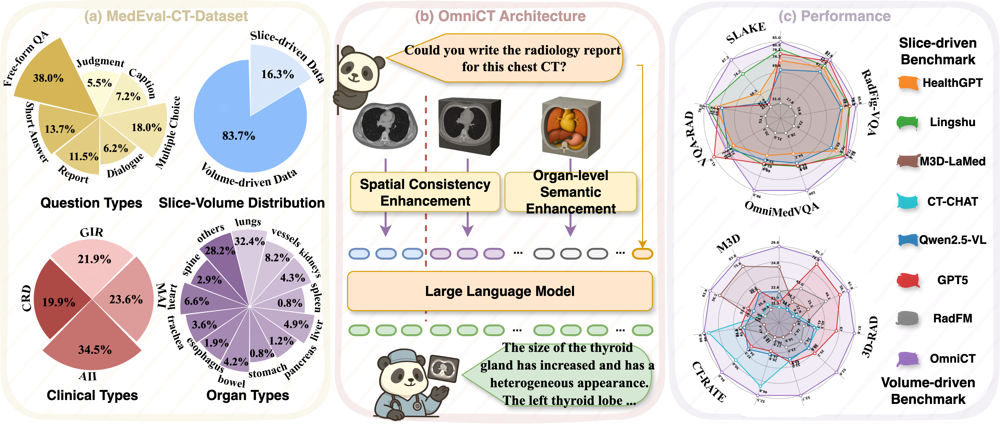

<h1 align="center">
OmniCT: Towards a Unified Slice-Volume LVLM for Comprehensive CT Analysis
</h1>

<div align="center">

Tianwei Lin<sup>1,2*</sup>, Zhongwei Qiu<sup>2,3,1*</sup>, Wenqiao Zhang<sup>1†</sup>, Jiang Liu<sup>1</sup>, Yihan Xie<sup>1</sup>, <br>
Mingjian Gao<sup>1</sup>, Zhenxuan Fan<sup>1</sup>, Zhaocheng Li<sup>1</sup>, Sijing Li<sup>1,2</sup>, Zhongle Xie<sup>1</sup>, <br>
Peng LU<sup>1</sup>, Yueting Zhuang<sup>1</sup>, Yingda Xia<sup>2</sup>, Ling Zhang<sup>2</sup>, Beng Chin Ooi<sup>1</sup> <br>

<sup>1</sup>Zhejiang University <sup>2</sup>DAMO Academy, Alibaba Group <sup>3</sup>Hupan Lab
<br>

<a href='https://arxiv.org/abs/2602.16110'></a>

</div>

## 🌟 Overview

**OmniCT** is a unified **Slice-Volume Large Vision-Language Model (LVLM)** designed for medical Computed Tomography (CT) scenarios. It supports both 2D slice-based inputs and 3D volume-based data, enabling comprehensive CT understanding and analysis within a unified framework.

<p align="center">
  
</p>

This project provides:

- 🧠 **Models**: `OmniCT-3B`, `OmniCT-7B`
- 📦 **Dataset**: `MedEval-CT-Dataset` (1.7M carefully curated samples)
- 📊 **Benchmark**: `MedEval-CT-Bench` (covering 13 organs and 4 task types)

## 🔥 News
- **[2026.01.26]** 🎉🎉🎉 [OmniCT](https://arxiv.org/abs/2602.16110) has been accepted by **ICLR 2026 as Poster** presentation.

**TODO:**
- [x] Release environment setup instructions  
- [ ] Release training and inference code  
- [ ] Release MedEval-CT (including `MedEval-CT-Dataset` and `MedEval-CT-Bench`)  
- [ ] Release pre-trained projection weights and full OmniCT model checkpoints  

## 🛠️ Getting Started

This section provides instructions for environment setup, inference, and training.

### Step 1: Environment Setup

First, clone the repository:

```bash
git clone https://github.com/XXX/OmniCT.git
cd OmniCT
```

Using uv for environment installation (Recommended)

```bash
uv python install 3.11
uv venv --python 3.11
uv sync
uv pip install -e . --no-deps
```

Or using Conda

```bash
conda create -n omnict python=3.11 -y
conda activate omnict
pip install -r requirements.txt
pip install -e . --no-deps
```

> 💡 We strongly recommend installing **Flash Attention** for optimal training and inference performance.

### Step 2: Inference and Traning Code

🤓 **Inference and training scripts will be available soon.**

## 📑 Citation

If OmniCT is helpful to your research or work, please consider citing:

```bibtex
@article{lin2026omnict,
  title={OmniCT: Towards a Unified Slice-Volume LVLM for Comprehensive CT Analysis},
  author={Lin, Tianwei and Qiu, Zhongwei and Zhang, Wenqiao and Liu, Jiang and Xie, Yihan and Gao, Mingjian and Fan, Zhenxuan and Li, Zhaocheng and Li, Sijing and Xie, Zhongle and others},
  journal={arXiv preprint arXiv:2602.16110},
  year={2026}
}
```

## ⭐ Acknowledgement

We sincerely thank all researchers and open-source contributors advancing the field of medical multimodal understanding.

If you find our work useful, please consider giving us a ⭐ Star!